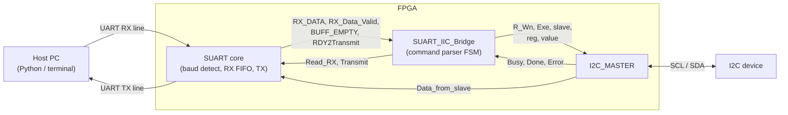

# SuperUART

**A UART with automatic baud-rate detection, an on-chip RX FIFO and a soft-reset key — plus a UART-to-I²C bridge — written in VHDL.**

SuperUART (`SUART`) is a UART core designed to remove the usual limitations of "ordinary" UART IP: the baud rate does not have to be known at synthesis time (the core measures it from a single `0x55` byte sent by the host), received bytes are buffered in a Xilinx FIFO, and the whole core can be re-armed for a new baud rate at run time with a 32-bit soft-reset key.

This repository also contains a ready-made use case: a **UART → I²C bridge** that lets a PC read and write registers of any I²C device (clock generators, RTCs, sensors …) through the same serial link, a Python host script, and a VHDL testbench.

> The older `README.pdf` documents the *encrypted Vivado IP-core* version of SuperUART (`suart_wrapper_v1_0`). This README documents the **VHDL source code** (`SUART.vhd`, `SUART_IIC_Bridge.vhd`, `I2C_MASTER.vhd`, …) and the test scenarios.

---

## Table of contents

1. [Features](#1-features)
2. [Repository layout](#2-repository-layout)
3. [System architecture](#3-system-architecture)
4. [The SUART core](#4-the-suart-core)
5. [UART ↔ I²C bridge](#5-uart--ic-bridge)
6. [I²C master](#6-ic-master)
7. [Reference design (block design)](#7-reference-design-block-design)
8. [Host software (Python)](#8-host-software-python)
9. [Simulation and test scenarios](#9-simulation-and-test-scenarios)
10. [Known limitations and design notes](#10-known-limitations-and-design-notes)
11. [Relation to the encrypted IP core](#11-relation-to-the-encrypted-ip-core)
12. [Authors and license](#12-authors-and-license)

---

## 1. Features

- **Arbitrary baud rate, auto-detected.** After reset the core waits for the host to send `0x55`; it measures the bit time in clock cycles and locks to it. No baud-rate generic, no divider to calculate.
- **Wide baud-rate range.** The input clock must be at least **4×** the baud rate (e.g. 25 Mbaud maximum at 100 MHz, "if the hardware lets you"). The original IP documentation reports successful tests from **300 baud up to 1 843 200 baud** (the highest rate a PC can generate).
- **FIFO-buffered RX.** Received bytes go into a Xilinx FIFO Generator block RAM FIFO, so the depth is whatever you configure. Status flags: `BUFF_EMPTY`, `BUFF_FULL`, `fifo_wr_ack`, `RX_Data_Valid`.
- **Run-time re-lock.** A hard reset (`rst_n`) or a **soft-reset key** (default `0x76 0xB1 0x9D 0x08`, configurable through a generic, can be disabled) returns the core to the "waiting for `0x55`" state so that a different baud rate can be used without reconfiguring the FPGA.
- **Simple user interface.** Rising-edge-triggered `Read_RX` and `Transmit` strobes, 8-bit data buses, no polarity checking, 8 data bits, no parity, 1 stop bit (8N1).
- **UART → I²C bridge** (`SUART_IIC_Bridge` + `I2C_MASTER`): 4-byte command preamble, then slave address, register address and (for writes) value. Reads return one byte over the UART.
- **Python host script** and **VHDL testbench** with a bit-accurate 921.6 kbaud serial stimulus.

---

## 2. Repository layout

| Path | Content |
|---|---|
| `vhdl_codes/` | VHDL sources: `SUART.vhd`, `SUART_IIC_Bridge.vhd`, `I2C_MASTER.vhd`, `SplitReg8.vhd`, testbench `TB_UART_I2C.vhd`, and the Python host script `2023_11_13_SUART_I2C_SI570.py` |
| `ip/` | Vivado IP packaging of the core |
| `README.pdf` | Documentation of the encrypted Vivado IP core |
| `README.md` | This document |

| Source file | Entity | Role |
|---|---|---|
| `SUART.vhd` | `SUART` | The super UART core (baud detection, RX with FIFO, TX, soft reset) |
| `SUART_IIC_Bridge.vhd` | `SUART_IIC_Bridge` | Command parser: turns UART bytes into I²C master requests and sends read results back |
| `I2C_MASTER.vhd` | `I2C_MASTER` | Byte-oriented I²C master with tri-state-split SDA |
| `SplitReg8.vhd` | `SplitReg8` | Helper that splits an 8-bit vector into 8 single-bit outputs (used to drive an LED from a received byte) |
| `TB_UART_I2C.vhd` | `TB_UART_I2C` | Testbench for the complete UART→I²C system |
| `2023_11_13_SUART_I2C_SI570.py` | – | PC-side script (pySerial) |

---

## 3. System architecture



Data path summary:

1. The PC sends bytes; `SUART` samples them and stores them in the RX FIFO.
2. `SUART_IIC_Bridge` pops bytes from the FIFO, recognises command frames and starts an `I2C_MASTER` transaction.
3. For an I²C read, the byte returned by the slave is fed to `SUART.TX_DATA` and transmitted back to the PC.

You can use `SUART` alone (Section 4) or together with the bridge (Sections 5–7).

---

## 4. The SUART core

### 4.1 Entity

```vhdl
entity SUART is
  generic (
    soft_rst_enable  : boolean := true;
    soft_rst_pattern : std_logic_vector(31 downto 0) := X"76B19D08"  -- MSB (first received byte) first
  );
  port (
    CLK           : in  std_logic;
    rst_n         : in  std_logic;
    RX            : in  std_logic;
    TX            : out std_logic := '1';
    Transmit      : in  std_logic;
    RDY2Transmit  : out std_logic;
    RX_DATA       : out std_logic_vector(7 downto 0);
    TX_DATA       : in  std_logic_vector(7 downto 0);
    RX_Data_Valid : out std_logic;
    Read_RX       : in  std_logic;
    BUFF_FULL     : out std_logic;
    BUFF_EMPTY    : out std_logic;
    fifo_wr_ack   : out std_logic
  );
end SUART;
```

**Generics**

| Generic | Default | Description |
|---|---|---|
| `soft_rst_enable` | `true` | Enables the soft-reset key. When `false`, the key is never acted upon (only `rst_n` can unlock the baud rate). |
| `soft_rst_pattern` | `X"76B19D08"` | 32-bit key. The byte `31..24` must be received first, `7..0` last. |

**Ports**

| Port | Dir | Description |
|---|---|---|
| `CLK` | in | Main clock. Must be **≥ 4 × baud rate**. All counters are in units of this clock. |
| `rst_n` | in | Hardware reset, active low. Also resets the FIFO and returns the core to baud-rate detection. |
| `RX` | in | UART receive line (idle high). Connect it to the master's TX, with pull-up. |
| `TX` | out | UART transmit line (idle high). Connect it to the master's RX. |
| `Transmit` | in | **Rising edge** starts the transmission of `TX_DATA`, provided `RDY2Transmit = '1'`. The signal must be seen low before the rising edge. |
| `RDY2Transmit` | out | `'1'`: core is idle and can accept a new byte. `'0'`: transmission in progress. |
| `TX_DATA` | in | Byte to transmit. There is **no TX FIFO** in this version. |
| `RX_DATA` | out | Output of the RX FIFO (the byte just read). |
| `RX_Data_Valid` | out | `'1'` when `RX_DATA` holds valid, freshly read FIFO data (FIFO `valid` flag). |
| `Read_RX` | in | **Rising edge** pops one byte from the RX FIFO. The signal must be seen low before the rising edge. |
| `BUFF_FULL` | out | RX FIFO is full – further received bytes are lost. |
| `BUFF_EMPTY` | out | `'0'` means *at least one byte is waiting* in the FIFO. Typically used as an interrupt/"data available" indicator. |
| `fifo_wr_ack` | out | FIFO write acknowledge – a received byte has been written. |

### 4.2 Required FIFO IP

`SUART.vhd` instantiates a Vivado **FIFO Generator** IP named `fifo_generator_0`, which is **not** included as a VHDL source. Generate it in your project with, at least:

| Setting | Value |
|---|---|
| Component name | `fifo_generator_0` |
| Interface | Native |
| FIFO implementation | Common clock, block RAM (distributed RAM also works) |
| Read mode | Standard (non-FWFT) – see note below |
| Data width | 8 |
| Depth | your choice (see below) |
| Reset | Synchronous reset (`srst`) |
| Optional flags | *Write Acknowledge* (`wr_ack`) and *Valid* (`valid`) enabled |

The component declaration in `SUART.vhd` expects exactly these ports: `clk, srst, din, wr_en, rd_en, dout, full, wr_ack, empty, valid, wr_rst_busy, rd_rst_busy`. If your FIFO Generator version produces a different port list, adapt the component declaration and port map accordingly.

> **Read mode.** The "standard" read mode is inferred from the handshake used by the bridge (assert read → wait for `valid` → sample `dout`). Check it against the FIFO configuration of your own Vivado project.
>
> **Depth.** Choose it from the longest burst the host can send while your logic is busy. As a reference, the supplied testbench queues up to about 18 bytes while the first I²C write is running.

### 4.3 Baud-rate auto-detection

After `rst_n` (or a soft reset) the core is *unlocked*: `BR_Locked = '0'`, the receiver is held in idle and nothing is written to the FIFO.

1. With the line idle (high), the host sends the byte **`0x55`** (`01010101`). With one start bit and one stop bit the frame on the wire is `1 0 1 0 1 0 1 0 1 0 1` – ten alternating levels.
2. A detection FSM follows the first ten transitions of the frame. It counts clock cycles of the low time of the start bit and of the high time of bit 0, and keeps the **shorter** one as `Period` (clock cycles per bit).
3. At the 11th transition (the stop bit) `BR_Locked` goes high. The `0x55` itself is **not** stored in the FIFO.
4. From now on, RX sampling and the TX bit clock are derived from `Period` (`Period/2` is used for centre sampling).

Because the result is an integer number of clock cycles, the relative baud-rate error grows as the oversampling ratio (`CLK / baud`) gets small. At the 4× minimum the quantisation error is large; use a larger ratio when a link must tolerate it.

| Baud rate | `Period` at 100 MHz (clock cycles per bit) |
|---|---|
| 300 | ≈ 333 333 |
| 9 600 | ≈ 10 417 |
| 115 200 | ≈ 868 |
| 921 600 | ≈ 108.5 |
| 1 843 200 | ≈ 54 |
| 25 000 000 (limit) | 4 |

Notes:

- Send `0x55` only **once per lock**, and wait for the core to lock (the Python script waits 100 ms) before sending data. A `0x55` sent while the core is already locked is just an ordinary data byte.
- The core has no `BR_Locked` output port. If you need it, expose the internal signal.
- The internal counters are limited to 100 000 000 clock cycles per bit.

### 4.4 Receive path

- Frame format: **8N1**, LSB first, idle high.
- The receiver detects the falling edge of the start bit, starts a free-running bit clock (`uart_clk`) and samples each data bit in the middle of the bit cell.
- After the 8th data bit it waits for `RX = '1'` (stop bit) and then strobes the byte into the FIFO (`WR2FIFO`, then `fifo_wr_ack`).
- There is **no parity, framing-error or break detection**; the stop bit is only waited for, not checked.

**Reading a byte (user-side handshake)**

```text
1. Wait until BUFF_EMPTY = '0'              -- a byte is available
2. Drive Read_RX = '0' for >= 1 CLK, then Read_RX = '1'   -- rising edge
      (the core issues a single-cycle read request to the FIFO)
3. Wait until RX_Data_Valid = '1'           -- RX_DATA is now valid
4. Sample RX_DATA
5. Drive Read_RX = '0' again before the next byte
```

`Read_RX` is processed on the rising edge of `CLK`; hold each level for at least one clock cycle.

### 4.5 Transmit path

```text
1. Wait until RDY2Transmit = '1'
2. Put the byte on TX_DATA
3. Make sure Transmit = '0', then drive Transmit = '1'   -- rising edge
4. Keep TX_DATA stable until RDY2Transmit goes '0'
5. The core sends start bit, 8 data bits (LSB first), stop bit;
   RDY2Transmit returns to '1' when the frame is finished
```

Details worth knowing:

- The TX bit clock free-runs once the baud rate is locked, so a frame starts on the next bit-clock boundary: the start bit may begin up to **one bit time** after the `Transmit` rising edge, and `TX_DATA` is latched at that moment. `RDY2Transmit` also falls with this delay, so a controller should keep `Transmit` high until it sees `RDY2Transmit = '0'` (the supplied bridge does exactly this) and release it afterwards.
- A `Transmit` rising edge while `RDY2Transmit = '0'` is ignored.

### 4.6 Resets

| Reset | Effect |
|---|---|
| `rst_n = '0'` (hard) | Clears baud-rate detection and the FIFO. The core waits for `0x55`. |
| **Soft reset** | Sending the four bytes of `soft_rst_pattern` (default `76 B1 9D 08`) back-to-back while locked produces an internal reset pulse that flushes the FIFO, clears `BR_Locked` and sends the core back to "waiting for `0x55`". The pulse clears itself as soon as the baud detector unlocks. |

After either reset, the host sends `0x55` again, possibly at a **different baud rate**. Practical sequence from a PC: send the key, wait ~100 ms, reopen the serial port at the new baud rate, send `0x55`.

Notes:

- The key is evaluated for every received byte. The key bytes themselves pass through the FIFO (and are therefore visible to whatever reads it, e.g. the bridge) before the reset flushes it.
- Matching restarts from scratch on a mismatch (the mismatching byte is not re-examined as a possible first key byte).
- With `soft_rst_enable => false` only `rst_n` can unlock the core.

### 4.7 Instantiation example

```vhdl
u_suart : entity work.SUART
  generic map (
    soft_rst_enable  => true,
    soft_rst_pattern => X"76B19D08"
  )
  port map (
    CLK           => clk100,
    rst_n         => rst_n,
    RX            => uart_rx,
    TX            => uart_tx,
    Transmit      => tx_go,
    RDY2Transmit  => tx_rdy,
    RX_DATA       => rx_data,
    TX_DATA       => tx_data,
    RX_Data_Valid => rx_valid,
    Read_RX       => rx_rd,
    BUFF_FULL     => rx_full,
    BUFF_EMPTY    => rx_empty,
    fifo_wr_ack   => rx_wr_ack
  );

-- Simplest possible consumer: pop every byte as soon as it arrives.
rx_rd <= not rx_empty;
```

The "auto-read" wiring `Read_RX <= not BUFF_EMPTY` is the one used by the *simple example design* of the original documentation (Section 7): the received byte is popped immediately and, for example, one bit of `RX_DATA` drives an LED.

---

## 5. UART ↔ I²C bridge

`SUART_IIC_Bridge` is a state machine that sits between the SUART and an `I2C_MASTER`. It continuously pops bytes from the SUART FIFO, looks for a 4-byte command preamble and executes the command.

### 5.1 Generics and ports

| Generic | Default | Meaning |
|---|---|---|
| `IIC_READ_PATTERN` | `X"A0B0C0D0"` | 4-byte preamble that starts an I²C **read** |
| `IIC_WRITE_PATTERN` | `X"A5B5C5D5"` | 4-byte preamble that starts an I²C **write** |

| Port | Dir | Connect to |
|---|---|---|
| `CLK` | in | same clock as SUART / I²C master |
| `SUART_DATA_RDY` | in | `SUART.RX_Data_Valid` |
| `SUART_TX_RDY` | in | `SUART.RDY2Transmit` |
| `SUART_DATA` | in | `SUART.RX_DATA` |
| `SUART_READ` | out | `SUART.Read_RX` |
| `SUART_TRANSMIT` | out | `SUART.Transmit` |
| `SUART_BUFF_EMPTY` | in | `SUART.BUFF_EMPTY` |
| `IIC_R_Wn` | out | `I2C_MASTER.R_Wn` |
| `IIC_Exe` | out | `I2C_MASTER.Exe` |
| `IIC_Slave_Addr` (7) | out | `I2C_MASTER.Slave_Address` |
| `IIC_Reg_addr` (8) | out | `I2C_MASTER.Reg_add` |
| `IIC_Reg_val_to_write` (8) | out | `I2C_MASTER.Data2slave` |
| `IIC_Busy` | in | `I2C_MASTER.I2C_Busy` |
| `IIC_DONE` | in | `I2C_MASTER.I2C_Done` |
| `IIC_ERROR` | in | `I2C_MASTER.I2C_Error` |

In addition, connect `I2C_MASTER.Data_from_slave` to `SUART.TX_DATA` so that read results can be transmitted.

> The bridge drives `Read_RX` itself, so do **not** also use the auto-read wiring of Section 4.7 on the same SUART.

### 5.2 Command protocol (host → FPGA)

All bytes are sent over the already-locked UART link (after the `0x55` initialisation).

**I²C write — 7 bytes, no response**

| Byte | Value | Meaning |
|---|---|---|
| 1–4 | `A5 B5 C5 D5` | write preamble |
| 5 | `SLAVE` | 8-bit slave address byte (see below) |
| 6 | `REG` | register address |
| 7 | `VAL` | value to write |

**I²C read — 6 bytes, 1 response byte**

| Byte | Value | Meaning |
|---|---|---|
| 1–4 | `A0 B0 C0 D0` | read preamble |
| 5 | `SLAVE` | 8-bit slave address byte |
| 6 | `REG` | register address |

The FPGA answers with **one byte**: the value read from the slave.

**Slave address byte.** Only bits `[7:1]` are used as the 7-bit I²C address; bit 0 is ignored (the I²C master inserts the R/W bit itself). A device with the 7-bit address `0x51` is therefore addressed as `0xA2` (`0x51 << 1`), the way it appears in many datasheets as the "write address".

**Examples**

```text
Write 0x88 to register 0x10 of the device at 7-bit address 0x51:
    A5 B5 C5 D5  A2  10  88

Read register 0x0A of the same device (response: 1 byte):
    A0 B0 C0 D0  A2  0A
```

**Parsing rules**

- Bytes that do not start a preamble are consumed and ignored, so stray bytes between commands are harmless. A byte that matches the first preamble byte but is followed by a wrong byte aborts the match.
- The first three preamble bytes are accepted if they match either the read *or* the write pattern; the **fourth byte decides** read vs. write (`D0` → read, `D5` → write).
- Commands may be queued back-to-back: bytes arriving while an I²C transaction is running accumulate in the SUART FIFO and are processed afterwards. Make sure the FIFO is deep enough.

### 5.3 State machine summary

| State(s) | Action |
|---|---|
| `phase0` | Idle. Waits for `SUART_BUFF_EMPTY = '0'`. |
| `phase1`–`phase15` | Pops four bytes (three states per byte: assert read, wait for valid data, compare) and compares them with the preamble. A mismatch returns to `phase0`. In `phase15`, `D0`/`D5` selects read/write. |
| `phase16`–`phase19` | Pops the slave-address byte (bits `7:1` latched). |
| `phase20`–`phase22` | Pops the register-address byte. |
| `phase23` | Branches to the read (`24`) or write (`30`) path. |
| `phase24`–`phase26` (read) | Asserts `IIC_Exe`, waits for `IIC_Busy`, releases `IIC_Exe`, waits for `IIC_DONE` and `SUART_TX_RDY`. |
| `phase27`–`phase29` (read) | Asserts `SUART_TRANSMIT`, waits until the SUART is busy and then ready again, releases `SUART_TRANSMIT`, returns to idle. |
| `phase30`–`phase33` (write) | Pops the value byte, asserts `IIC_Exe`. |
| `phase34`–`phase35` (write) | Waits for `IIC_Busy`, releases `IIC_Exe`, waits for `IIC_DONE`, returns to idle. |
| `phase36`–`phase37` | Error path (I²C master reported `IIC_ERROR`): two states, then back to idle. |

### 5.4 Error behaviour

- If the I²C master signals an error (no ACK), the bridge drops back to idle after two clock cycles. **No error code is sent to the host.** For a read, no response byte arrives, so the host must use a **timeout** (the supplied script uses `timeout = 1` s) to detect a failed read; a failed write is silent.
- There is no timeout inside the bridge: a command cut short (for example only `A0 B0` sent) leaves the bridge waiting for the remaining bytes, which then get interpreted as part of that command. See [limitations](#10-known-limitations-and-design-notes).

---

## 6. I²C master

`I2C_MASTER` performs one register access per `Exe` rising edge.

```vhdl
generic (
  Input_CLK_Freq    : integer range 1_000_000 to 300_000_000 := 100_000_000;  -- Hz
  I2C_Bus_CLK_Freq  : integer range 100_000 to 3_500_000     := 100_000       -- Hz
);
port (
  CLK, Rst_n : in std_logic;
  R_Wn       : in std_logic;                       -- '1' read, '0' write
  Exe        : in std_logic;                       -- start (rising edge)
  SCL        : out std_logic;
  SDA_i      : in  std_logic;                      -- tri-state split SDA
  SDA_o      : out std_logic;
  SDA_t      : out std_logic;                      -- '1' = release the line (input), '0' = drive
  I2C_Done   : out std_logic;
  Slave_Address : in  std_logic_vector(6 downto 0);
  Data2slave    : in  std_logic_vector(7 downto 0);
  Reg_add       : in  std_logic_vector(7 downto 0);
  Data_from_slave : out std_logic_vector(7 downto 0);
  I2C_Error  : out std_logic;                      -- no ACK received
  I2C_Busy   : out std_logic                       -- transaction in progress
);
```

- `SCL` is generated by dividing `CLK` by `Input_CLK_Freq / I2C_Bus_CLK_Freq`; SDA changes are placed in the middle of the SCL low phase.
- `SDA_t` follows the Xilinx `IOBUF` convention (`T = '1'` → high impedance). Typical hardware hook-up: `IOBUF (I => SDA_o, T => SDA_t, O => SDA_i, IO => SDA)` with an external pull-up.
- `Exe` must be seen low again before another transaction can start; `I2C_Busy` is high while the bus is in use.

**Transaction format as implemented**

```text
Write: START | ADDR+W | ACK | REG | ACK | DATA | ACK | STOP
Read : START | ADDR+R | ACK | REG | ACK | DATA(from slave) | master ACK | STOP
```

`I2C_Done` is set at the end of a successful transaction; `I2C_Error` is set when an expected ACK is missing.

> **Check before relying on reads.** In the read case the register address is sent *after* an address byte that already carries the **read** bit, and there is no repeated START. Most I²C devices expect a *write* of the register pointer first, then a repeated START and a read address. Verify this transaction format against your target device (and with a logic analyser) before depending on it.

---

## 7. Reference design (block design)

The documentation and testbench refer to a Vivado block design (`MAIN_BD1`) built from the modules above. The block design itself is not part of the VHDL sources, but it is straightforward to rebuild.

**Simple example design** (SUART only)

| From | To |
|---|---|
| `ST1_CLK100` | `SUART.CLK` |
| `ext_RSTn` | `SUART.rst_n` |
| `UART_RX` | `SUART.RX` |
| `SUART.TX` | `UART_TX` |
| `SUART.BUFF_EMPTY` → inverter | `SUART.Read_RX` (auto-read) |
| `SUART.RX_DATA` | `SplitReg8.In0` |
| `SplitReg8.Out3` → inverter | `XU9_LED2[0]` |

Every received byte is popped immediately; bit 3 of the last received byte drives a board LED (through an inverter). Sending `0x07` and `0x08` alternately therefore toggles the LED.

**Complete example design** (SUART + bridge + I²C master)

- `SUART`, `SUART_IIC_Bridge` and `I2C_MASTER` share the 100 MHz clock (`ST1_CLK100`) and reset (`ext_RSTn`).
- Bridge ↔ SUART and bridge ↔ I²C master connections as in the table of [Section 5.1](#51-generics-and-ports); `I2C_MASTER.Data_from_slave → SUART.TX_DATA`.
- The I²C master's `SDA_i / SDA_o / SDA_t / SCL` are brought out of the block design (SDA through an `IOBUF` on the board).
- Optionally, `SplitReg8` + inverter can still show a bit of the received data on an LED.

Top-level ports of `MAIN_BD1` as used by the testbench: `ext_RSTn`, `ST1_CLK100`, `UART_RX`, `UART_TX`, `SDA_i`, `SDA_o`, `SDA_t`, `SCL`, `XU9_LED2[0:0]`.

---

## 8. Host software (Python)

**Requirements:** Python 3.10+ and [pySerial](https://pyserial.readthedocs.io/).

Install the dependency:

```bash
python -m pip install pyserial
```

**Host utility:** `vhdl_codes/2023_11_13_SUART_I2C_SI570.py`

The script no longer opens a serial port or executes hardware commands when imported. It provides a command-line interface; specify the serial port with `--port` and optionally change the baud rate or timeout. Defaults are `/dev/ttyUSB3`, 9600 baud and a 1-second serial timeout.

```bash
# Send the 0x55 auto-baud detection pattern
python vhdl_codes/2023_11_13_SUART_I2C_SI570.py --port /dev/ttyUSB3 init

# Read register 0x0A from slave address byte 0xA2
python vhdl_codes/2023_11_13_SUART_I2C_SI570.py --port /dev/ttyUSB3 read 0xA2 0x0A

# Write 0x88 to register 0x10
python vhdl_codes/2023_11_13_SUART_I2C_SI570.py --port /dev/ttyUSB3 write 0xA2 0x10 0x88

# Send the default soft-reset key
python vhdl_codes/2023_11_13_SUART_I2C_SI570.py --port /dev/ttyUSB3 reset
```

Run `python vhdl_codes/2023_11_13_SUART_I2C_SI570.py --help` for all options. Values accept decimal notation or `0x`-prefixed hexadecimal notation. The utility validates byte values, reports connection/write errors, uses serial timeouts, and returns a non-zero status when a read/write receives no response before the timeout.

The bridge's command frames remain unchanged:

| Operation | Bytes sent |
|---|---|
| Auto-baud detection | `55` |
| Soft reset | `76 B1 9D 08` |
| I²C read | `A0 B0 C0 D0 slave register` |
| I²C write | `A5 B5 C5 D5 slave register value` |

**Address convention:** the host utility transmits the slave-address byte exactly as entered. For example, `0xA2` is the 8-bit write-form address byte corresponding to 7-bit I²C address `0x51`. Confirm the convention expected by your hardware and target device before connecting it.

On Linux, make sure your user can access the serial device (commonly by membership in the `dialout` group). The utility is hardware-dependent; a successful Python syntax check does not validate the FPGA protocol or attached I²C device.

---

## 9. Simulation and test scenarios

### 9.1 Testbench overview — `TB_UART_I2C`

The testbench instantiates the complete system (`MAIN_BD1`: SUART + bridge + I²C master) and provides three stimuli:

| Stimulus | Description |
|---|---|
| **Clock** | `CLK = 100 MHz` (`not CLK after 5 ns`) |
| **Serial stimulus** | A 256-bit constant `RX_array` is sent byte by byte, **LSB first, 8N1, plus one extra idle bit-time between frames** (each frame lasts 11 bit-times). The bit clock `clk_suart` has a half period of 542.53 ns → bit time 1085.06 ns → **≈ 921.6 kbaud** (≈ 108.5 CLK cycles per bit). Transmission starts after 100 µs. |
| **I²C slave stub** | `SDA_i` is driven high and pulled low for 10 µs at fixed times to imitate ACKs (a 10 µs pulse = one SCL cycle at 100 kHz). There is no real slave model. |

`ext_RSTn` is tied to `'1'`; the core relies on baud-rate detection alone.

### 9.2 Serial stimulus

`RX_array = X"5514563700F8A5B5C5D50000CC0AA55A03A5B5C5D500A508FFBC151526A0B003"` (first byte on the left). The process sends `k = 1 … 31`, i.e. the first **31 bytes**; the last constant byte `03` is never sent. Start times below are computed from the testbench timing (they are not simulator log values).

| # | Byte(s) | Starts at (≈) | Purpose / expected behaviour |
|---|---|---|---|
| 0 | `55` | 100.4 µs | Baud-rate detection. The SUART locks at the end of this frame (≈ 111 µs), `Period ≈ 108/109`; nothing is written to the FIFO. |
| 1–5 | `14 56 37 00 F8` | 112 µs | **Noise** before the first command. Each byte is stored, popped by the bridge and discarded. No I²C activity. |
| 6–12 | `A5 B5 C5 D5` `00` `00` `CC` | 172 µs | **I²C write #1**: slave `0x00`, register `0x00`, value `0xCC`. The last byte is complete at ≈ 254 µs, so the I²C transaction starts at about that time. |
| 13–16 | `0A A5 5A 03` | 255 µs | **False-start test**: `A5` matches the first preamble byte but `5A` does not match `B5`; the bridge must abort and resynchronise. These bytes arrive while write #1 is still running and are processed afterwards. |
| 17–23 | `A5 B5 C5 D5` `00` `A5` `08` | 303 µs | **I²C write #2**: slave `0x00`, register `0xA5`, value `0x08`. Executed after write #1 has finished. |
| 24–28 | `FF BC 15 15 26` | 387 µs | **Noise** after the second command; must be discarded. |
| 29–30 | `A0 B0` | 446 µs | Start of a **read preamble that is never completed** (the testbench stops after 31 bytes, and even the unsent `03` would not be a valid third byte). No read is performed; the bridge ends up waiting inside the preamble. |

All frames are completed by ≈ 470 µs.

An earlier stimulus line is kept commented out in the testbench (`...00F8A0B0C0D00000CC...`): it replaces the first write command by a complete **read** command (`A0 B0 C0 D0 00 00`). Swapping it in exercises the read path, including the transmission of the result on `UART_TX`; the `SDA_i` stub would need to be extended to deliver the read data bits.

### 9.3 `SDA_i` stub (ACK pulses)

| Window | `SDA_i` | Interpreted as |
|---|---|---|
| 0 – 340 µs | `1` | idle bus |
| 340 – 350 µs | `0` | ACK of address byte, write #1 |
| 430 – 440 µs | `0` | ACK of register byte, write #1 |
| ≈ 520 µs | `1` (no pulse) | **no ACK for the data byte of write #1** |
| 645 – 655 µs | `0` | ACK of address byte, write #2 |
| 735 – 745 µs | `0` | ACK of register byte, write #2 |
| 825 – 835 µs | `0` | ACK of data byte, write #2 |

By inspection of `I2C_MASTER` (the design was not simulated for this document), the first write therefore ends with `I2C_Error` (missing data ACK) and the second one with `I2C_Done`: the testbench exercises **both the error path and the success path** of the bridge/I²C chain. Window timings are approximate (SCL starts when `Exe` is accepted, plus a few clock cycles of synchronisation).

### 9.4 How to run (Vivado)

1. Create a project and add `SUART.vhd`, `SUART_IIC_Bridge.vhd`, `I2C_MASTER.vhd`, `SplitReg8.vhd` (design sources) and `TB_UART_I2C.vhd` (simulation source).
2. Generate the FIFO IP `fifo_generator_0` as described in [Section 4.2](#42-required-fifo-ip).
3. Create a block design named `MAIN_BD1` (or write an equivalent VHDL top level with the same ports) following [Section 7](#7-reference-design-block-design), using the complete example design with the `I2C_MASTER`; generate its HDL wrapper.
4. Set `TB_UART_I2C` as the simulation top and run for **at least 1 ms** (the last ACK pulse ends at 835 µs).

Handy signals to add to the waveform:

| Block | Signals |
|---|---|
| SUART | `RX`, `BRD_STATE`, `Period`, `BR_Locked`, `RX_STATE`, `uart_clk`, `RX_DATA2FIFO`, `WR2FIFO`, `fifo_wr_ack`, `BUFF_EMPTY`, `BUFF_FULL`, `soft_rst_state`, `soft_rst`, `TX`, `RDY2Transmit` |
| Bridge | `MAIN_STATE`, `SUART_READ`, `SUART_DATA`, `IIC_R_Wn`, `IIC_Exe`, `IIC_Slave_Addr`, `IIC_Reg_addr`, `IIC_Reg_val_to_write` |
| I²C master | `SCL`, `SDA_o`, `SDA_t`, `SDA_i`, `I2C_Busy`, `I2C_Done`, `I2C_Error`, `SDA_state` |

### 9.5 Pass criteria for the supplied testbench

- [ ] `BR_Locked` rises at the end of the first frame (≈ 111 µs) and `Period` is ≈ 108–109.
- [ ] The `0x55` byte produces **no** `fifo_wr_ack`; all following bytes do (31 − 1 = 30 acks).
- [ ] Bytes 1–5 are consumed by the bridge (`MAIN_STATE` returns to `phase0`) without `IIC_Exe` activity.
- [ ] Write #1: `IIC_R_Wn = 0`, `IIC_Slave_Addr = 0x00`, `IIC_Reg_addr = 0x00`, `IIC_Reg_val_to_write = 0xCC`; `IIC_Exe` pulses once and `I2C_Error` is reported after the missing data ACK.
- [ ] After the false start (`A5 5A`), write #2 is decoded correctly: `IIC_Reg_addr = 0xA5`, `IIC_Reg_val_to_write = 0x08`, finishing with `I2C_Done`.
- [ ] Trailing noise is discarded; the final `A0 B0` leaves the bridge waiting in the preamble states.
- [ ] `SCL` is ≈ 100 kHz; SDA changes only while SCL is low; START/STOP conditions are visible.
- [ ] `BUFF_FULL` never asserts.

### 9.6 Hardware bring-up scenarios

| ID | Scenario | Steps | Expected result |
|---|---|---|---|
| HW-1 | Baud lock + LED echo (simple example design) | Open the port, send `55`, wait 100 ms, then alternately send `07` and `08` | LED toggles with bit 3 of the last byte |
| HW-2 | Soft reset and re-lock at another baud rate | Send `76 B1 9D 08`, wait, reopen the port at a new baud rate, send `55`, repeat HW-1 | Core works at the new rate without reprogramming |
| HW-3 | I²C write / read-back | `i2c_write(dev, reg, val)` then `i2c_read(dev, reg)` on a writable register | Read returns `val` |
| HW-4 | NACK handling | Read or write a non-existent device address | Read returns no byte (host timeout); write is silent; the next command works normally |
| HW-5 | Stray bytes | Insert random bytes between commands | Commands are still decoded correctly |
| HW-6 | Baud-rate sweep | Repeat HW-1 at 300, 9 600, 115 200, 921 600, 1 843 200 baud | Lock and correct operation at each rate (the original IP documentation reports this range) |

### 9.7 Suggested additional tests

These are **not** in the repository yet; they would close the main gaps of the current testbench:

- **Read command** with a slave stub that supplies data bits: check `UART_TX` carries the correct byte, `SUART_TRANSMIT`/`RDY2Transmit` handshake and I²C read ACK handling.
- **Soft reset in simulation:** send `76 B1 9D 08` after lock, check `soft_rst`, FIFO flush, `BR_Locked → 0`, then re-lock with a different bit time.
- **Different baud rates / clock ratios** (including the 4× limit) with the same stimulus process parameterised by bit time.
- **FIFO overflow:** hold `Read_RX` low and send more bytes than the FIFO depth; check `BUFF_FULL` and defined behaviour.
- **TX path stand-alone:** pulse `Transmit` with and without `RDY2Transmit`, check frame timing and the one-bit-time latency.
- **Truncated command recovery** (see limitations).

---

## 10. Known limitations and design notes

These come from reading the source; they are listed so you can decide whether they matter for your application.

**SUART core**

- 8N1 only. No parity, framing-error or overrun reporting; the stop bit is waited for, not validated. A full FIFO silently loses incoming bytes (`BUFF_FULL` is the only indication).
- `RX`, `Transmit` and `Read_RX` are used directly by logic clocked from `CLK` (or from falling edges of it). Add a two-flip-flop synchroniser on `RX` if the signal comes from an unrelated source (a normal USB-UART bridge is asynchronous to your FPGA clock).
- There is no `BR_Locked` port and no TX FIFO.
- `RDY2Transmit` and the TX bit clock are only meaningful once the baud rate is locked.
- The detection requires an idle-high line followed by the exact alternating pattern of `0x55`; any other first byte will give a wrong `Period` or no lock.
- Several processes use falling clock edges, derived clocks (`uart_clk`, `TX_uart_clk`) and latch-style assignments (e.g. `soft_rst`). It is functional as delivered, but expect timing-analysis/lint warnings and treat clock-domain constraints with care.

**Bridge**

- No reset port and no internal timeout: a command that is cut short, or a soft reset in the middle of a command, can leave the bridge consuming the following bytes as arguments. Always send complete frames; recover by sending a complete dummy frame or by reloading the design.
- Errors are not reported back to the host (see Section 5.4).
- Intermediate preamble bytes accept either the read or write variant; only the fourth byte selects the operation.

**I²C master**

- No clock stretching (SCL is output-only). SDA is actively driven high in some bit slots instead of being released, which is fine with ordinary pull-ups and a single master but is not strictly open-drain.
- Read transaction format as noted in Section 6.
- The data ACK of a write is evaluated at the end of the transaction; any NACK sets `I2C_Error` and suppresses `I2C_Done`.

**Documentation / tooling**

- `fifo_generator_0` and the `MAIN_BD1` block design are Vivado artefacts that must be regenerated by the user.
- The supplied testbench transmits 31 of the 32 bytes of `RX_array` and ends with an incomplete read preamble (see Section 9.2).

---

## 11. Relation to the encrypted IP core

| | Encrypted Vivado IP (`README.pdf`) | VHDL source (this repository) |
|---|---|---|
| Top level | `suart_wrapper_v1_0` | `SUART` |
| Soft-reset key | Fixed to the default key in the encrypted core | `soft_rst_enable`, `soft_rst_pattern` generics |
| FIFO | Inside the IP | You instantiate/generate `fifo_generator_0` |
| Ports | `CLK, rst_n, RX, Transmit, TX_DATA[7:0], Read_RX` / `TX, RDY2Transmit, RX_DATA[7:0], RX_Data_Valid, BUFF_FULL, BUFF_EMPTY, fifo_wr_ack` | Same ports |

The port semantics, baud-rate detection (`0x55`) and default soft-reset key (`0x76B19D08`) are identical. The block diagrams in `README.pdf` show an earlier revision of the I²C wrapper (`IIC_Wrapper`, with an `IIC_RST_n` output on the bridge); the VHDL in this repository uses `I2C_MASTER` and an `IIC_Busy` input instead.

---

## 12. Authors and license

SuperUART is developed by **Dr. Ir. Siavash Ardekani** and **ETROYL**.

The source files include copyright and SPDX license headers. The repository is released under the **MIT License**; see [`LICENSE`](LICENSE) for the complete terms. Contributions are welcome; please read [`CONTRIBUTING.md`](CONTRIBUTING.md) before opening a pull request.

Contributions, bug reports and test results at other baud rates are welcome — please open an issue or pull request.
